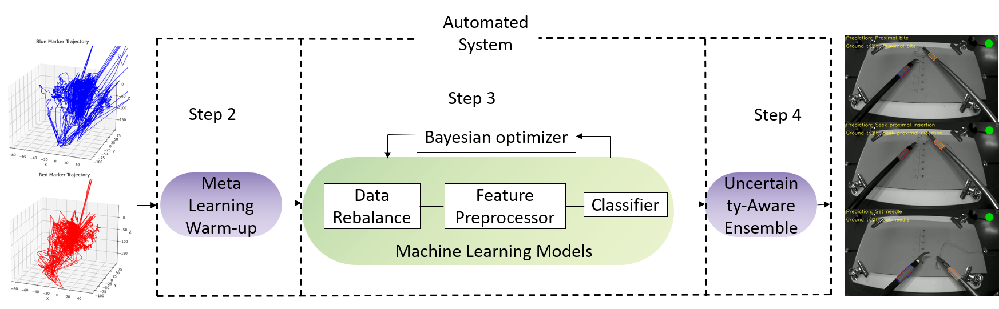

<p align="center">
  
</p>


# AutoMedTS
<p align="center">
  
</p>

> **Automating Clinical Time Series Intelligence**  
> An end-to-end automated ML framework tailored for clinical time-series data. Streamline data preprocessing, model selection, hyperparameter optimization, and uncertainty-aware ensembling—minimal manual effort required. Originally developed to deliver real-time action recognition and feedback
in laparoscopic surgery training. It integrates multiple class-imbalance handling strategies (including power transform, temperature-scaled softmax, and SMOTE). AutoMedTS automatically searches for optimal models and hyperparameters, providing an end-to-end pipeline for training and inference. The framework is easily extensible to other medical time-series tasks and offers comprehensive evaluation metrics (Macro-F1, Balanced Accuracy, MCC) along with visualization tools for performance analysis and feedback.

---

## 🚀 Key Features

- **Instant Pipeline**  
  From raw time-series to deployable model in a single `fit()` call.
- **Advanced Imbalance Handling**  
  SMOTE, temperature-scaled Softmax, power-law mapping, jitter augmentation.
- **Meta-Learning Warm-Start**  
  Seed Bayesian optimizer with high-quality configurations from prior tasks.
- **Uncertainty-Aware Ensembling**  
  Greedy forward-selection with variance penalty for robust predictions.
- **Real-Time Inference**  
  High throughput and low latency—ideal for live surgical feedback.
- **Modular & Extensible**  
  Swap in custom preprocessors, resamplers, models, or metrics.

---

## Quick Start Example

```python
import os
import pandas as pd
from sklearn.model_selection import train_test_split
from sklearn.metrics import accuracy_score, classification_report
from automedts.classification import automedtsClassifier

# Load one novice trajectory file
data = pd.read_csv(os.path.join('data', 'surgical_trajectory', 'novice.csv'))
X, y = data.iloc[:, :-1].values, data.iloc[:, -1].values

# Split into train/test
X_train, X_test, y_train, y_test = train_test_split(
    X, y, test_size=0.5, random_state=42
)

# Train AutoMedTS classifier (automatically applies sliding-window)
automl = automedtsClassifier(time_left_for_this_task=3600, per_run_time_limit=360)
automl.fit(X_train, y_train)

# Predict and evaluate
y_pred, y_win = automl.predict(X_test, y=y_test)
print("Accuracy:", accuracy_score(y_win, y_pred))
print(classification_report(y_win, y_pred))


